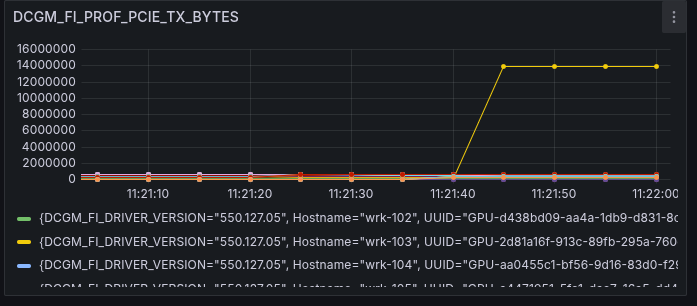
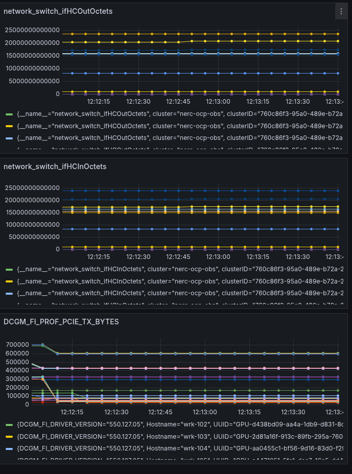

# Call 2025-04-30
- Chris, Jonathan, Thor
## ToDos
- [x] sheet to an overview of metrics (about GPU and snmp) collected
  - [x] https://docs.google.com/spreadsheets/d/1WKQnSWOexOiUXfrgQyj4VEW8S6sGl51DZtNJTMdmZNk/edit?usp=sharing
---
- [x] how to get no data to zero? (dashboard: yes, export: ?)
  - [x] metric or (absent(metric) * 0)
    - [x] If the metric exists → use it.
    - [x] If it's missing → absent(...) * 0 returns 0 in its place.
    - [ ] `network_switch_ifHCInOctets{vendor="NVIDIA",ifAlias=~"MOC-R4PCC02U15.*|MOC-R4PCC02U16.*|MOC-R4PCC02U24.*|MOC-R4PCC02U25.*|MOC-R4PCC02U29.*|MOC-R4PCC02U30.*|MOC-R4PCC02U31.*|MOC-R4PCC02U32.*"} OR (absent(network_switch_ifHCInOctets{vendor="NVIDIA",ifAlias=~"MOC-R4PCC02U15.*|MOC-R4PCC02U16.*|MOC-R4PCC02U24.*|MOC-R4PCC02U25.*|MOC-R4PCC02U29.*|MOC-R4PCC02U30.*|MOC-R4PCC02U31.*|MOC-R4PCC02U32.*"})*0)`
  - [x] clamp_min(metric,0)
    - [x] Any negative value or null (which is skipped in Prometheus) becomes 0
    - [x] All other values are unchanged
    - [x] `clamp_min(network_switch_ifHCInOctets{vendor="NVIDIA",ifAlias=~"MOC-R4PCC02U15.*|MOC-R4PCC02U16.*|MOC-R4PCC02U24.*|MOC-R4PCC02U25.*|MOC-R4PCC02U29.*|MOC-R4PCC02U30.*|MOC-R4PCC02U31.*|MOC-R4PCC02U32.*"},0)`
---
- [x] how can we get data under 10 sec?
  - [x] irate seems to be 10min and up (in Grafana), can be smaller in OpenShift console, it is maybe a Grafan topic?
- [x] verify if it is real 5 sec data, and not just a filled/copied from last value
- [x] see graphics A) below for proof
  - [ ] still not 100% sure if prometheus or the hardware is filling missing data with the last value?
---
- [x] dashboard for the metrics we talked about today
- [x] https://grafana.apps.obs.nerc.mghpcc.org/d/dekhjru8m2fb4b/v1?from=2025-03-31T16:10:07.715Z&to=2025-04-30T16:10:07.715Z&timezone=browser
  - [x] DCGM_FI_PROF_PCIE_TX_BYTES
    - [x] https://docs.nvidia.com/datacenter/dcgm/2.3/dcgm-user-guide/feature-overview.html#profiling
```
PCIe Bandwidth
The rate of data transmitted / received over the PCIe bus,
including both protocol headers and data payloads,
in bytes per second.
The value represents an average over a time interval
and is not an instantaneous value.
The rate is averaged over the time interval. For example,
if 1 GB of data is transferred over 1 second, the rate is 1 GB/s
regardless of the data transferred at a constant rate or in bursts.
The theoretical maximum PCIe Gen3 bandwidth
is 985 MB/s per lane.
```
  - [x] network_switch_ifMtu
    - [x] `network_switch_ifMtu{vendor="NVIDIA", ifAlias=~"MOC-R4PCC02U15.*|MOC-R4PCC02U16.*|MOC-R4PCC02U24.*|MOC-R4PCC02U25.*|MOC-R4PCC02U29.*|MOC-R4PCC02U30.*|MOC-R4PCC02U31.*|MOC-R4PCC02U32.*"}`
  - [x] network_switch_ifHCOutOctets
    - [x] `network_switch_ifHCOutOctets{vendor="NVIDIA",ifAlias=~"MOC-R4PCC02U15.*|MOC-R4PCC02U16.*|MOC-R4PCC02U24.*|MOC-R4PCC02U25.*|MOC-R4PCC02U29.*|MOC-R4PCC02U30.*|MOC-R4PCC02U31.*|MOC-R4PCC02U32.*"}`
  - [x] network_switch_ifHCInOctets
---
- [ ] script and token
---
- [x] are all points from jonathan's list (see Table A) included in the query? 32 rows
- [x] yes
  - [x] `count(network_switch_ifMtu{vendor="NVIDIA", ifAlias=~"MOC-R4PCC02U15.*|MOC-R4PCC02U16.*|MOC-R4PCC02U24.*|MOC-R4PCC02U25.*|MOC-R4PCC02U29.*|MOC-R4PCC02U30.*|MOC-R4PCC02U31.*|MOC-R4PCC02U32.*"}) by (ifDescr)` = 32
  - [x] `count(network_switch_ifMtu{vendor="NVIDIA", ifAlias=~"MOC-R4PCC02U15.*|MOC-R4PCC02U16.*|MOC-R4PCC02U24.*|MOC-R4PCC02U25.*|MOC-R4PCC02U29.*|MOC-R4PCC02U30.*|MOC-R4PCC02U31.*|MOC-R4PCC02U32.*"}) by (ifAlias, ifDescr)` = 32
  - [x] `count(network_switch_ifHCOutOctets{vendor="NVIDIA",ifAlias=~"MOC-R4PCC02U15.*|MOC-R4PCC02U16.*|MOC-R4PCC02U24.*|MOC-R4PCC02U25.*|MOC-R4PCC02U29.*|MOC-R4PCC02U30.*|MOC-R4PCC02U31.*|MOC-R4PCC02U32.*"})` = 32
  - [x] `count(count(network_switch_ifHCOutOctets{vendor="NVIDIA",ifAlias=~"MOC-R4PCC02U15.*|MOC-R4PCC02U16.*|MOC-R4PCC02U24.*|MOC-R4PCC02U25.*|MOC-R4PCC02U29.*|MOC-R4PCC02U30.*|MOC-R4PCC02U31.*|MOC-R4PCC02U32.*"}) by (ifAlias,ifDescr,ifIndex,ifName))` = 32

---
- Graphics A)
### every 5 seconds
 
 

---
- Table A)
### Jonathan's Table
| ID | Hostname | MAC | Port | Switch? | Switch MAC? | IP | VLAN? | VLAN ID? |
|---|---|---|---|---|---|---|---|---|
| 1 | MOC-R4PCC02U15 | a0:88:c2:27:c2:d0 | swp16s0 | MOC-R4PCC02-SW-TORS | b0:cf:0e:c2:99:ff |  |  |  |
| 2 | MOC-R4PCC02U15 | a0:88:c2:27:c2:d4 | swp16s1 | MOC-R4PCC02-SW-TORS | b0:cf:0e:c2:99:ff | 192.168.50.119 | barcelona-net | 581 |
| 3 | MOC-R4PCC02U15 | a0:88:c2:27:c2:d8 | swp40s0 | MOC-R4PCC02-SW-TORS | b0:cf:0e:c2:99:ff |  |  |  |
| 4 | MOC-R4PCC02U15 | a0:88:c2:27:c2:dc | swp40s1 | MOC-R4PCC02-SW-TORS | b0:cf:0e:c2:99:ff |  |  |  |
| 5 | MOC-R4PCC02U16 | a0:88:c2:27:c0:d0 | swp15s0 | MOC-R4PCC02-SW-TORS | b0:cf:0e:c2:99:ff |  |  |  |
| 6 | MOC-R4PCC02U16 | a0:88:c2:27:c0:d4 | swp15s1 | MOC-R4PCC02-SW-TORS | b0:cf:0e:c2:99:ff | 192.168.50.145 | barcelona-net | 581 |
| 7 | MOC-R4PCC02U16 | a0:88:c2:27:c0:d8 | swp39s0 | MOC-R4PCC02-SW-TORS | b0:cf:0e:c2:99:ff |  |  |  |
| 8 | MOC-R4PCC02U16 | a0:88:c2:27:c0:dc | swp39s1 | MOC-R4PCC02-SW-TORS | b0:cf:0e:c2:99:ff |  |  |  |
| 9 | MOC-R4PCC02U24 | a0:88:c2:27:be:20 | swp11s0 | MOC-R4PCC02-SW-TORS | b0:cf:0e:c2:99:ff |  |  |  |
| 10 | MOC-R4PCC02U24 | a0:88:c2:27:be:24 | swp11s1 | MOC-R4PCC02-SW-TORS | b0:cf:0e:c2:99:ff | 192.168.50.157 | barcelona-net | 581 |
| 11 | MOC-R4PCC02U24 | a0:88:c2:27:be:28 | swp35s0 | MOC-R4PCC02-SW-TORS | b0:cf:0e:c2:99:ff |  |  |  |
| 12 | MOC-R4PCC02U24 | a0:88:c2:27:be:2c | swp35s1 | MOC-R4PCC02-SW-TORS | b0:cf:0e:c2:99:ff |  |  |  |
| 13 | MOC-R4PCC02U25 | a0:88:c2:27:bb:d0 | swp10s0 | MOC-R4PCC02-SW-TORS | b0:cf:0e:c2:99:ff |  |  |  |
| 14 | MOC-R4PCC02U25 | a0:88:c2:27:bb:d4 | swp10s1 | MOC-R4PCC02-SW-TORS | b0:cf:0e:c2:99:ff | 192.168.50.18 | barcelona-net | 581 |
| 15 | MOC-R4PCC02U25 | a0:88:c2:27:bb:d8 | swp34s0 | MOC-R4PCC02-SW-TORS | b0:cf:0e:c2:99:ff |  |  |  |
| 16 | MOC-R4PCC02U25 | a0:88:c2:27:bb:dc | swp34s1 | MOC-R4PCC02-SW-TORS | b0:cf:0e:c2:99:ff |  |  |  |
| 17 | MOC-R4PCC02U29 | a0:88:c2:27:c4:80 | swp8s0 | MOC-R4PCC02-SW-TORS | b0:cf:0e:c2:99:ff |  |  |  |
| 18 | MOC-R4PCC02U29 | a0:88:c2:27:c4:84 | swp8s1 | MOC-R4PCC02-SW-TORS | b0:cf:0e:c2:99:ff | 192.168.50.171 | barcelona-net | 581 |
| 19 | MOC-R4PCC02U29 | a0:88:c2:27:c4:88 | swp32s0 | MOC-R4PCC02-SW-TORS | b0:cf:0e:c2:99:ff |  |  |  |
| 20 | MOC-R4PCC02U29 | a0:88:c2:27:c4:8c | swp32s1 | MOC-R4PCC02-SW-TORS | b0:cf:0e:c2:99:ff |  |  |  |
| 21 | MOC-R4PCC02U30 | a0:88:c2:27:c0:80 | swp7s0 | MOC-R4PCC02-SW-TORS | b0:cf:0e:c2:99:ff |  |  |  |
| 22 | MOC-R4PCC02U30 | a0:88:c2:27:c0:84 | swp7s1 | MOC-R4PCC02-SW-TORS | b0:cf:0e:c2:99:ff | 192.168.50.57 | barcelona-net | 581 |
| 23 | MOC-R4PCC02U30 | a0:88:c2:27:c0:88 | swp31s0 | MOC-R4PCC02-SW-TORS | b0:cf:0e:c2:99:ff |  |  |  |
| 24 | MOC-R4PCC02U30 | a0:88:c2:27:c0:8c | swp31s1 | MOC-R4PCC02-SW-TORS | b0:cf:0e:c2:99:ff |  |  |  |
| 25 | MOC-R4PCC02U31 | a0:88:c2:27:c4:50 | swp6s0 | MOC-R4PCC02-SW-TORS | b0:cf:0e:c2:99:ff |  |  |  |
| 26 | MOC-R4PCC02U31 | a0:88:c2:27:c4:54 | swp6s1 | MOC-R4PCC02-SW-TORS | b0:cf:0e:c2:99:ff | 192.168.50.65 | barcelona-net | 581 |
| 27 | MOC-R4PCC02U31 | a0:88:c2:27:c4:58 | swp30s0 | MOC-R4PCC02-SW-TORS | b0:cf:0e:c2:99:ff |  |  |  |
| 28 | MOC-R4PCC02U31 | a0:88:c2:27:c4:5c | swp30s1 | MOC-R4PCC02-SW-TORS | b0:cf:0e:c2:99:ff |  |  |  |
| 29 | MOC-R4PCC02U32 | a0:88:c2:27:c5:60 | swp5s0 | MOC-R4PCC02-SW-TORS | b0:cf:0e:c2:99:ff |  |  |  |
| 30 | MOC-R4PCC02U32 | a0:88:c2:27:c5:64 | swp5s1 | MOC-R4PCC02-SW-TORS | b0:cf:0e:c2:99:ff | 192.168.50.153 | barcelona-net | 581 |
| 31 | MOC-R4PCC02U32 | a0:88:c2:27:c5:68 | swp29s0 | MOC-R4PCC02-SW-TORS | b0:cf:0e:c2:99:ff |  |  |  |
| 32 | MOC-R4PCC02U32 | a0:88:c2:27:c5:6c | swp29s1 | MOC-R4PCC02-SW-TORS | b0:cf:0e:c2:99:ff |  |  |  |

---
### script
- create a service account with grafana
  - Home -> Administration -> Users and access -> Service accounts
  - create a Service Account Token (#ServiceAccountToken)

```
GRAFANA_URL="https://grafana.apps.obs.nerc.mghpcc.org"
GRAFANA_TOKEN="#ServiceAccountToken"
PROMQL_QUERY='network_switch_ifHCOutOctets{vendor="NVIDIA"}'
STEP="10"  # 10 Seconds steps

# last 24hours
START=$(date -u -d '24 hours ago' +%s)
END=$(date -u +%s)

RESPONSE=$(curl -s -G "${GRAFANA_URL}/api/datasources/proxy/1/api/v1/query_range" \
  -H "Authorization: Bearer ${GRAFANA_TOKEN}" \
  --data-urlencode "query=${PROMQL_QUERY}" \
  --data-urlencode "start=${START}" \
  --data-urlencode "end=${END}" \
  --data-urlencode "step=${STEP}")

echo "$RESPONSE" | jq .
```

```
# for a specific time frame
START=$(date -u -d '2025-04-25 08:00:00' +%s)
END=$(date -u -d '2025-04-25 12:00:00' +%s)

```
---
check for the correct proxy number (api/datasources/proxy/1/api/v1/query_range) with:
```
curl -s -H "Authorization: Bearer #ServiceAccountToken" "https://grafana.apps.obs.nerc.mghpcc.org/api/datasources" | jq
```