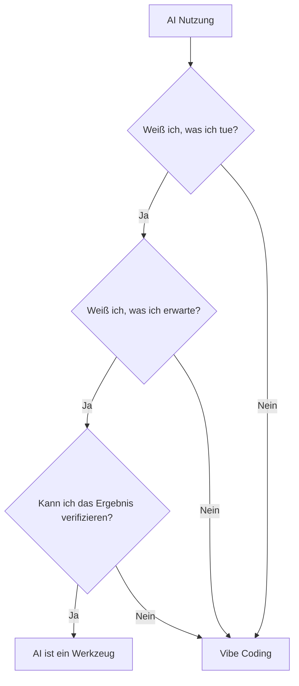

```mermaid
flowchart TD
    A[AI Nutzung] --> B{Weiß ich, was ich tue?}
    B -->|Ja| C{Weiß ich, was ich erwarte?}
    B -->|Nein| V[Vibe Coding]

    C -->|Ja| D{Kann ich das Ergebnis verifizieren?}
    C -->|Nein| V

    D -->|Ja| T[AI ist ein Werkzeug]
    D -->|Nein| V
```
