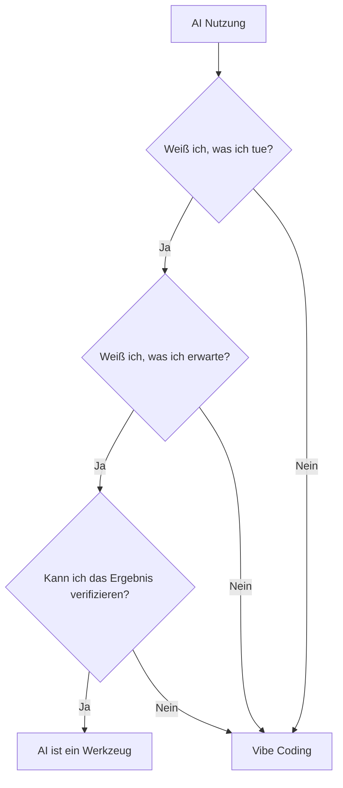
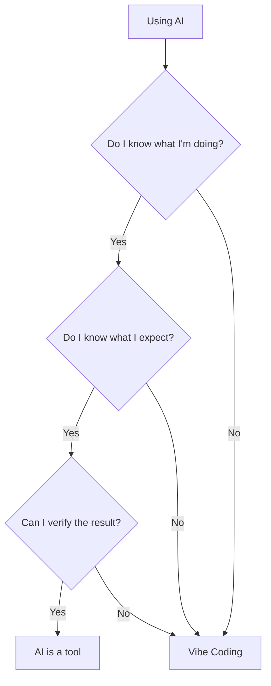

```mermaid
flowchart TD
    A[AI Nutzung] --> B{Weiß ich, was ich tue?}
    B -->|Ja| C{Weiß ich, was ich erwarte?}
    B -->|Nein| V[Vibe Coding]

    C -->|Ja| D{Kann ich das Ergebnis verifizieren?}
    C -->|Nein| V

    D -->|Ja| T[AI ist ein Werkzeug]
    D -->|Nein| V
```

```mermaid
flowchart TD
    A[Using AI] --> B{Do I know what I'm doing?}
    B -->|Yes| C{Do I know what I expect?}
    B -->|No| V[Vibe Coding]

    C -->|Yes| D{Can I verify the result?}
    C -->|No| V

    D -->|Yes| T[AI is a tool]
    D -->|No| V
```
