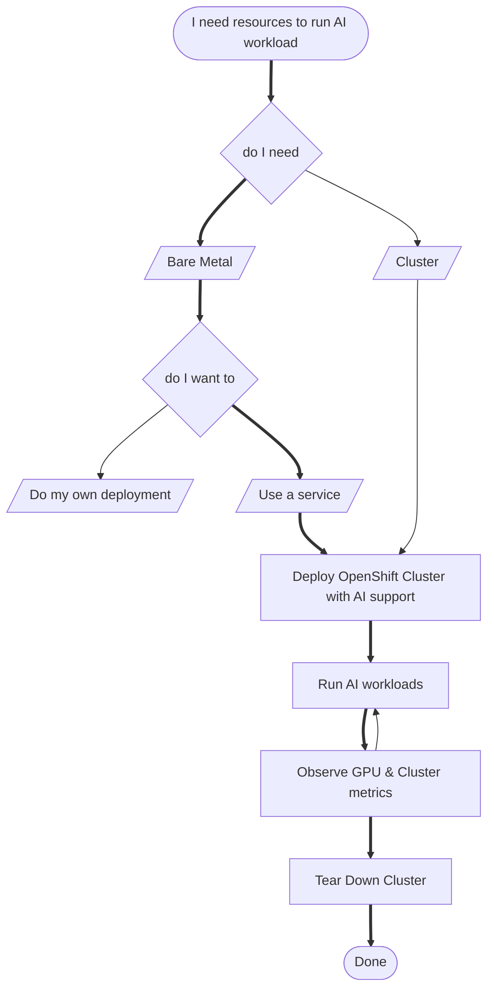
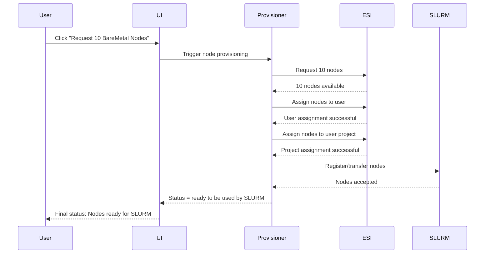
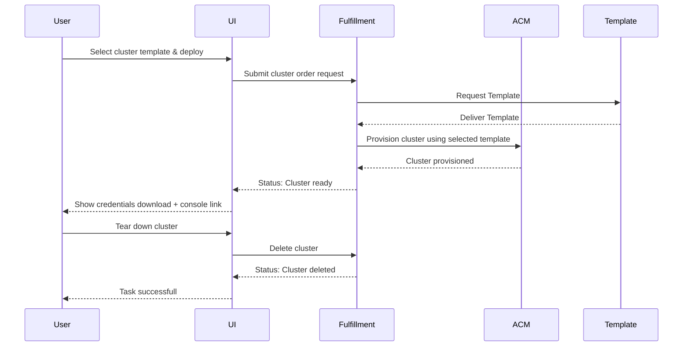
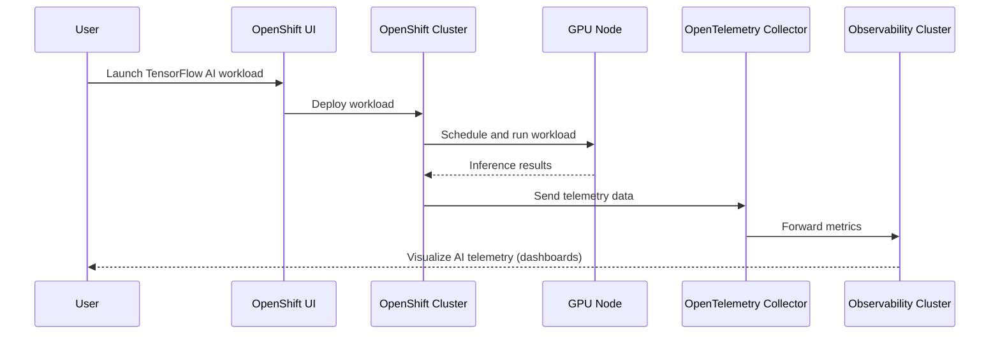
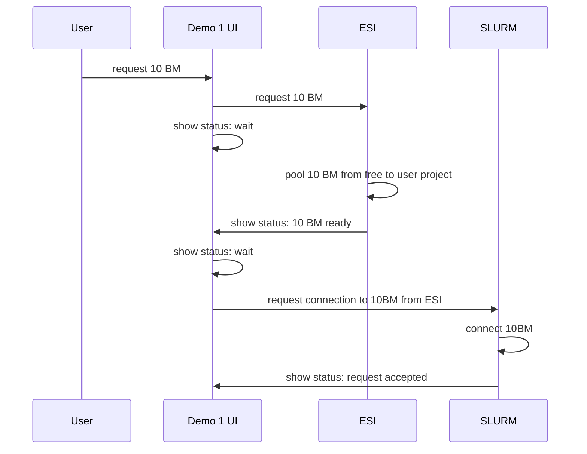
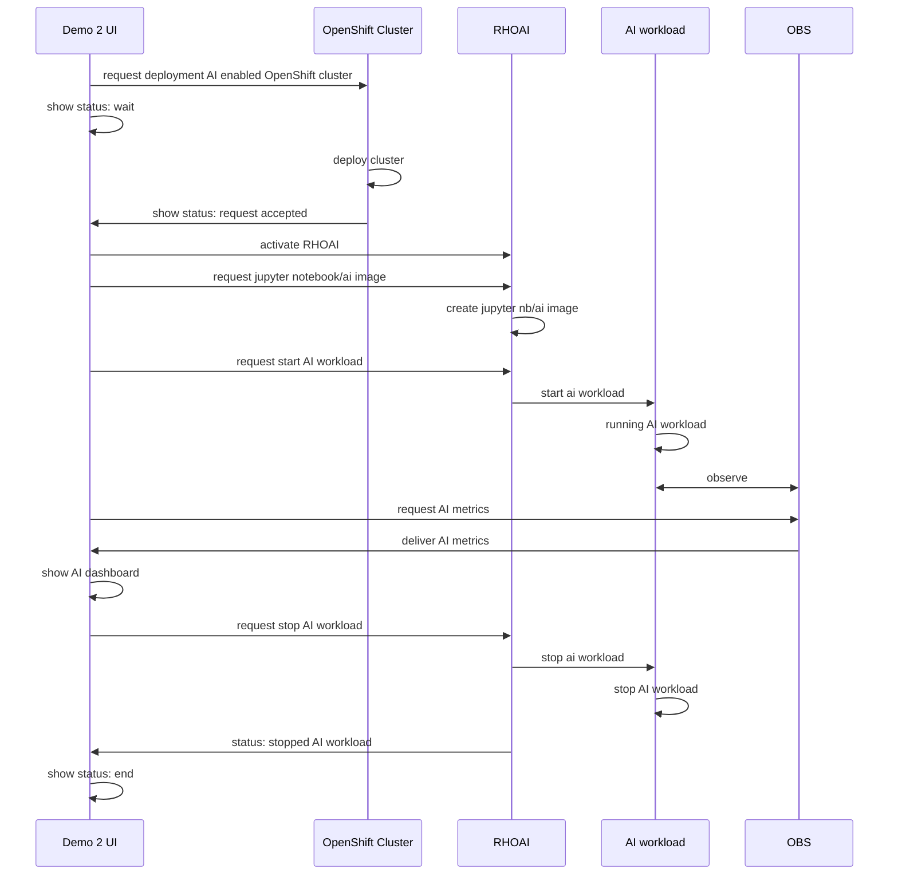

v2
# Demo Story – AI Hub Build 1
## you need to run AI workloads?

### you can either
- lease/add your own BareMetal nodes from ESI through our UI
  - SLURM peers with ESI about 10 BM

### or, if you just want to lease Cluster as a server
- deploy an OpenShift cluster through our UI
  - you get the credentials and 2 links (RHOAI & OBS grafana)
  - from our clusters, but this could the the BM nodes from above in general (not yet)

### while we are waiting for the deployment..
we already created an OpenShift Cluster with AI support beforehand
-  go to the console from the link above
-  start your AI workload
-  follow the second link from above to see the obs dashboard with your AI metrics and infrastructure metrics

### after these great metrics and dashboards, let's check the readiness of our earlier created 

---

---
### **Demo Story – AI Hub Build 1: BareMetal Provisioning & Handover to SLURM**

#### **Goal of the Demo**

Demonstrate that ten BareMetal nodes can be successfully:

1.  Requested from the ESI node pool
    
2.  Reserved for a specific user
    
3.  Assigned to that user’s project
    
4.  Handed over to the SLURM workload manager
    
5.  Confirmed as available and ready by SLURM
    

This will prove that nodes can be integrated with standard workload managers, forming the technical basis for future automation and service integration in later demo phases.

***

#### **Actors**

-   **User** – initiates the process via the UI
    
-   **UI** – provides interaction interface (button & status updates)
    
-   **ESI** – manages BareMetal nodes, users, and their projects
    
-   **SLURM** – receives and manages the nodes
    
-   **Provisioning Component** (behind the UI) – communicates with ESI and SLURM
    

***

#### **Demo Flow (from the UI perspective)**

1.  **User clicks “Request 10 BareMetal Nodes”**
    
    -   The UI triggers the provisioning component.
        
2.  **Status: “10 BareMetal nodes requested”**
    
    -   Provisioning component sends request to ESI.
        
3.  **Status: “10 BareMetal nodes assigned to user”**
    
    -   ESI confirms the nodes are reserved for the user.
        
4.  **Status: “10 BareMetal nodes assigned to user project”**
    
    -   Nodes are associated with the user’s project within ESI.
        
5.  **Status: “10 BareMetal nodes connecting to SLURM”**
    
    -   The provisioning component begins the handover to SLURM.
        
6.  **Status: “10 BareMetal nodes ready and assigned to SLURM”**
    
    -   SLURM is peered with ESI. (SLURM is communicating with ESI.)
        
7.  **Final state: “Nodes are ready to be used by SLURM”**-
    
    -   Success: The nodes can now be scheduled and used by SLURM jobs.
        

***

#### **Technical Notes**

-   Communication:
    
    -   UI ↔ Provisioning Component via API
        
    -   Provisioning Component ↔ ESI via existing ESI API (users, projects, node allocation)
        
    -   Provisioning Component ↔ SLURM via plugin, dynamic config, or REST (depending on setup)

### **Demo Story – AI Hub Build 1: OpenShift Cluster Provisioning via innabox**

#### **Goal of the Demo (Part 2.1)**

Demonstrate that a user can provision and manage an OpenShift cluster using pre-reserved BareMetal nodes through the **innabox fulfillment service**, using a UI-driven workflow.

This is a **Cluster-as-a-Service** scenario, in contrast to Part 1’s **BareMetal-as-a-Service**. While ideally the same nodes from Part 1 would be reused, the current process is not yet fully automated or integrated — thus this step is demonstrated independently.

***

#### **Actors**

-   **User** – initiates the cluster deployment and views progress
    
-   **UI** – allows interaction with the fulfillment service (ordering, status, credentials, teardown)
    
-   **ACM** – includes the fulfillment service, must be pre-installed
    
-   **Template** – pre-defined OpenShift cluster configuration for GPU/RHOAI
    
-   **innabox Fulfillment API** – processes the order and deploys the cluster
    

***

#### **Prerequisites**

-   ACM and the innabox fulfillment service are installed and running
    
-   Templates for OpenShift clusters are available
    

***

#### **Demo Flow (from the UI perspective)**

1.  **User selects a cluster template in the UI**
    
    -   UI sends request to the fulfillment service to create a cluster order
        
2.  **Status updates shown in UI** (e.g., “Deploying cluster…”)
    
3.  **Once the cluster is ready:**
    
    -   UI provides a **download link** for the OpenShift cluster credentials (e.g., `kubeconfig`)
        
    -   UI provides a **link to the OpenShift web console**
        
4.  **User tears down the cluster via UI** (maybe not/optional)

### **Demo Story – AI Hub Build 1: AI Workloads on OpenShift**

#### **Goal of the Demo (Part 2.2)**

Demonstrate the execution and observability of a real AI workload running on an OpenShift cluster pre-configured for AI use cases.

This part shows that the platform is ready for AI operations and integrates well with observability tooling.

***

#### **Actors**

-   **User** – initiates and observes AI workloads
    
-   **OpenShift UI** – existing OpenShift and MOC components are reused
    
-   **OpenTelemetry Collector** – collects AI telemetry
    
-   **Observability Cluster** – stores and displays metrics
    

***

#### **Prerequisites**

-   A **pre-created OpenShift cluster**, deployed via innabox (see 2.1)
    
-   The cluster is **pre-configured for AI workloads** (see 2.1)
    
-   **GPU nodes** are available and scheduled for the AI workload
    
-   **OpenTelemetry Collector** is installed and set up on the cluster
    
-   **Observability cluster** is ready to receive and display telemetry
    

***

#### **Demo Flow**

1.  **User navigates to OpenShift console (existing UI, RHOAI)**
    
2.  **Deploys an AI workload**:
    
    -   TensorFlow image recognition example
        
    -   Uses GPU
        
3.  **AI workload runs inside OpenShift AI environment**
    
4.  **OpenTelemetry Collector captures telemetry (performance, resource use, etc.)**
    
5.  **Telemetry is visualized** in the observability cluster

---
---
---
---
---
---
---
---
---
---
---
---
---
---
---
---
---
---
---
---
---
---
---
first draw
---

---
