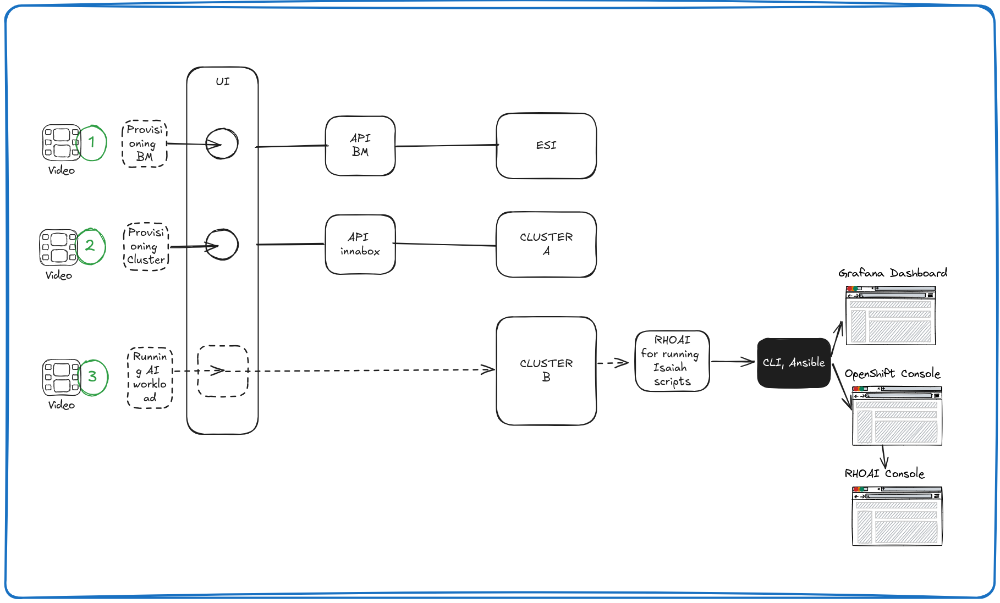

# MOC for AI Hub (Build 1)  
**Version:** `v1.0`  
**Date:** `2025-05-06`  
**Format:** Slides and Recorded Videos

---

## Required Materials

- Speaker notes embedded in slides (voice-over + additional context)
- **Slides:** [Google Slides Link](https://docs.google.com/presentation/d/1q5lARbFZN6eFlrSLleitlGQkdZSJZ9q3vC6RYmVPAjU/edit?usp=sharing)
- **Recorded Videos:**
  - **Video 1** – *Title TBD* – Length: `TBD`, [Link], Size: `TBD`
  - **Video 2** – *Title TBD* – Length: `TBD`, [Link], Size: `TBD`
  - **Video 3** – *Title TBD* – Length: `TBD`, [Link], Size: `TBD`
  - Backup folder with all raw and processed video assets

---

## Planned Duration

- **Minimum Duration**: x minutes
  - Videos 1 and 3
  - 5 minutes for slide presentation

- **Maximum Duration**:  y minutes
  - Videos 1, 2, and 3
  - 10 minutes for slide presentation
  - 10 minutes for Q&A

---

## Audience

- Decision-makers  
- Politicians  
- Professors  
- Users  
- Buyers  
- Government representatives  

---

## Presentation Focus

- **Less** technical detail in the main talk  
- **More** focus on:
  - **What** is needed
  - **How** the solution addresses it
  - **Why** this approach was chosen
- Technical deep-dives only during Q&A

---
## Key Messages

### What

- Aligns with your RFI/RFP for the **AI Hub / AICR Project – Year 1**
- Infrastructure at scale:
  - Hundreds of nodes
  - 1,000 AI/ML accelerators
  - 1,000 network ports across 2–3 isolated networks
- Designed for:
  - 500–1,000 user accounts
  - 100–200 active accounts at any given time
- Full stack approach:
  - From hardware → to tools → to services
- Scalable, easy to manage, and fully observable

### How

- **Provisioning**: Bare metal machines  
- **Provisioning**: AI/ML-ready OpenShift clusters  
- **Executing**: AI workloads  
- Delivered via a **scalable self-service UI**  
- Built on expertise and tools from **MOC** and **Red Hat**:
  - OpenShift, ACM, RHEL, RHOAI, Prometheus, Grafana, ROCE, and innabox

### Why

- **Red Hat** has deep experience with cluster and multicluster management  
  - Integrating AI capabilities through RHOAI and others  
- **MOC** is already operating similar systems under similar constraints and requirements  

---

## Flow Diagram
 

---

# Presentation Sections

## Introduction

**Topic**: Challenges addressed by AI Hub Build 1

---

## Provisioning Bare Metal Machines  
**Video 1**

### Steps:

1. Launch the UI ([link to UI])
2. Navigate to **"Bare Metal Nodes"**
   - View available nodes in ESI
   - Filter/sort by name, class, power state, provision state, network
3. Click **"Manage"** next to the desired node
4. Navigate to **"Bare Metal Orders"**
   - Click **"Create"**
   - Enter order description
   - Select network
   - Submit the order **"Create a bare metal order"**
   - Wait for it to appear in the list
5. Return to **"Bare Metal Nodes"** to confirm changes in power and provision state

### Background Workflow:

- UI communicates with ESI via BM-API
- Node information is requested and displayed
- Upon request, ESI provisions selected machines
- ...

---

## Provisioning Clusters  
**Video 2**

### Steps:

1. Launch the UI (same as above)
2. Navigate to **"Cluster Templates"**
   - Browse or filter templates by title or description 
3. Go to **"Cluster Requests"**
   - Click **"Create"**
   - Optionally mention **"Import"**
   - Fill in cluster name
   - Select template
   - Select user
   - Submit request **"Create a cluster request"**
   - Wait for it to appear in the list
4. Check **"Managed Clusters"** for deployment status

### Background Workflow:

- UI connects to the innabox fulfillment API
- Deployment orchestrated through the backend pipeline
- ...

---

## Running AI Workloads  
**Video 3**

### Steps:

1. Launch the NERC OpenShift Console ([link])
   - Navigate to **Pods View**, project: `nvidia-gpu-operator`
   - Track deployment changes via terminal
2. Open Terminal
   - Run Ansible scripts for setup
   - Fast-forward through ~5-minute setup process
3. Back in Console:
   - Switch to project: `demo`
   - Review script/workload results
   - Open Red Hat OpenShift AI (RHOAI)
     - View Data Science Projects
     - Select the demo
   - Open Grafana Dashboard ([link])
     - Visualize AI workload results
